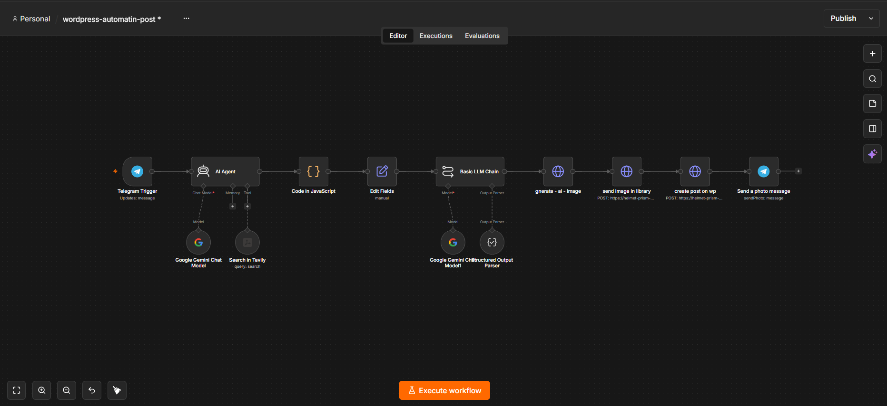

# 🚀 n8n WP AI Blogger (Autonomous Content & Media Generator)

یک اتوماسیون هوشمند و خودکار بر پایه **n8n** و **AI Agent** که تنها با دریافت یک عنوان یا موضوع ساده از طریق **ربات تلگرام**، یک مقاله وبلاگی بسیار جامع، سئوشده، دارای تم رنگی دینامیک و تصویر شاخص اختصاصی تولید کرده و مستقیماً به عنوان پیش‌نویس در **وردپرس** منتشر می‌کند.

---

## 🎬 پیش‌نمایش و دمو (Demo)

برای مشاهده عملکرد زنده و سریع سیستم از ارسال پیام در تلگرام تا تولید مقاله در وردپرس، دموی زیر را مشاهده کنید:

### 📹 ویدیو دمو (Video Preview)
> 💡 **نکته:** فیلم کوتاه نحوه کارکرد ربات و ثبت پست در وردپرس را می‌توانید از لینک زیر مشاهده کنید:
> 

---

### 📸 اسکرین‌شات جریان کاری (Workflow Canvas)

---

## 🌟 ویژگی‌های کلیدی سیستم (Key Features)

* **🤖 رابط کاربری تلگرام (Telegram Trigger):** شروع کل جریان کاری بدون نیاز به ورود به پنل، تنها با ارسال یک پیام متنی.
* **🌐 جستجوی زنده در وب (Tavily Search Engine):** ایجنت قبل از تولید محتوا، جدیدترین داده‌های مرتبط با موضوع را از وب استخراج کرده تا مقاله‌ای به‌روز و مستند بنویسد.
* **🎨 سیستم رنگ‌بندی dynamic (Dynamic Color Palette):** تشخیص هوشمند حوزه مقاله (پزشکی، فناوری، مالی، آشپزی و...) و اعمال اتوماتیک پالت رنگی CSS اختصاصی روی باکس‌های راهنما و FAQ.
* **📸 تولید تصویر شاخص حرفه‌ای (Flux AI Model):** ترجمه هوشمند عنوان به پرامپت انگلیسی تحلیلی و ساخت تصویر باکیفیت بالا توسط مدل **Flux**.
* **🖼️ مدیریت هوشمند رسانه وردپرس (Media Library Integration):** آپلود مستقیم تصویر در مخزن رسانه وردپرس و ست کردن آن به عنوان `Featured Image`.
* **🛠️ پردازش و سالم‌سازی کدها (JavaScript Sanitizer):** نود کدنویسی‌شده برای اصلاح خودکار فرمت JSON، حذف خطاها و تنظیم صحیح ساختار HTML تصاویر.
* **🔔 اطلاع‌رسانی بازگشتی (Telegram Feedback):** ارسال پیام تایید و تصویر شاخص ساخته‌شده به تلگرام کاربر پس از ثبت مقاله در وردپرس.

---

## 🛠️ تکنولوژی‌ها و ابزارهای استفاده‌شده

| ابزار / سرویس | نقش در اتوماسیون |
| :--- | :--- |
| **n8n** | مدیریت ارکستراسیون و سناریوی اتوماسیون |
| **Telegram Bot API** | دریافت ورودی کاربر و ارسال پیام بازخورد |
| **LangChain AI Agent** | ایجنت تصمیم‌گیرنده برای سرچ و ساختاردهی محتوا |
| **Google Gemini 1.5** | مدل زبانی اصلی برای نگارش مقاله و مهندسی پرامپت |
| **Tavily Search API** | موتور جستجوی هوشمند برای دریافت اطلاعات به‌روز وب |
| **Pollinations AI (Flux)** | تولید تصاویر شاخص اختصاصی با کیفیت عالی |
| **WordPress REST API** | ثبت پست‌ها و آپلود فایل‌های رسانه‌ای |

---

## 📐 ساختار خروجی مقالات (Article Architecture)

مقاله تولیدشده شامل بخش‌های استاندارد زیر است:
1. **باکس خلاصه‌سازی و زمان مطالعه:** همراه با تم رنگی مرتبط با موضوع مقاله.
2. **بدنه اصلی و عمیق:** شامل ۵ تا ۷ تیتر اصلی (`H2`) و زیرعنوان‌های تخصصی (`H3`).
3. **تصاویر داخلی بین متنی:** درج تصاویر مرتبط متناسب با بخش‌های مختلف مقاله.
4. **باکس پرسش‌های متداول (FAQ):** شامل سوالات کلیدی و پاسخ‌های تحلیلی.

---

## 🚀 نحوه راه‌اندازی (Installation & Setup)

1. **دانلود فایل JSON:** فایل `wordpress-automatin-post.json` موجود در این مخزن را دانلود کنید.
2. **ورود به n8n:** وارد محیط n8n شده و گزینه **Import from File** را بزنید و فایل را بارگذاری کنید.
3. **تنظیم کلیدها (Credentials):**
   * **Telegram API:** کلید API ربات تلگرام خود را جایگزین کنید.
   * **Google Gemini API:** کلید مربوط به Google AI Studio را ست کنید.
   * **Tavily API:** کلید API رایگان Tavily را وارد کنید.
   * **WordPress Credentials:** یک `Application Password` در بخش کاربران وردپرس ایجاد کرده و در n8n تنظیم کنید.
4. **تنظیم URL سایت:** در نودهای HTTP Request مربوط به وردپرس، عبارت `<YOUR_WORDPRESS_URL>` را با آدرس سایت خود جایگزین کنید.
5. **فعال‌سازی:** ورکفلو را **Active** کنید و در تلگرام به ربات خود پیام دهید!

